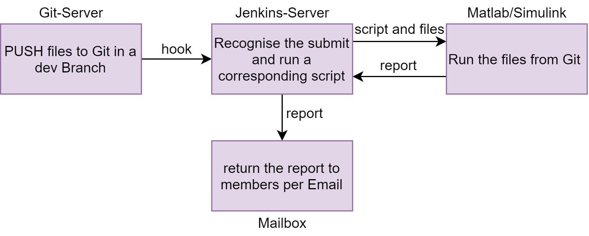
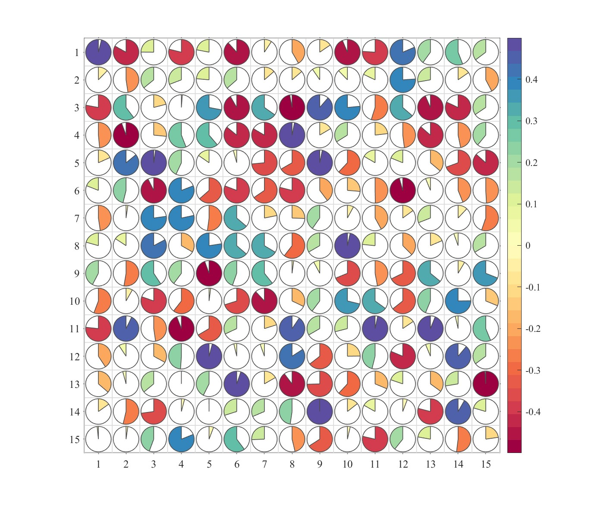

# Tutorial of Jenkins <br><small><small>Workflow from *Jenkins* to *Git* & *Matlab/Simulink*</small></small>


---
## Project`s structure
This Project contains 3 Parts: *Git*, *Jenkins* and *Matlab/Simulink* (working environment):
- Push new project file (`.m` from *Matlab* or `.slx` from *Simulink*) to the current dev branch to *Git* (here we use *Gitlab*).
- *Jenkins* find and recognise this submit with a tool named **Hook**, then responce to this with running specified Scripts (based on shell, Python u.s.w.) to call the submitted project files.
- After finishing executing the project files, generate a report return it to the group members per Email.
<p align = "center">    

</p>


---
## Configuration of *Gitlab*
A Server of Git deployed in private Cloud Plattform promotes teamwork and information security.

For development one Project of *Gitlab* should contain several brachs, one for stable release (main branch) and others for development and test, until they are finished and then merged.

Some commonly used commands if you deploy the *Gitlab* in local Linux server:
```shell
gitlab-ctl status  # check current working state
gitlab-ctl start
gitlab-ctl restart 
gitlab-ctl stop
```
Then add a webhook under path of the corresponding project.  
<p align = "center">    

</p>

The `URL` here is generated by Jenkins, in part of trigger for remote build. You can give it a self defined token for a specified project. The Format of this url should be:
```shell
JENKINS_URL/buildByToken/build?job=NAME&token=SECRET
```
Here we use here a plugin named `Build Authorization Token Root` to skip Authorization when a third party server wants to trigger this webhook (gitlab).


---
## Configuration of *Jenkins*
Things to note are, to drive *Matlab/Simulink* with *Jenkins*`s plug-in, the *Jenkins* should be deployed in the same server of *Matlab/Simulink*. Because implementing this process with Scripts in Pipeline of *Jenkins* could be easier than that with calling shell script to drive *Matlab/Simulink* installed in another server. But of course this depends on specified demands.

In this Tutorial, Pipeline of *Jenkins* will be used to drive *Matlab/Simulink* to run the project file and return the results. So both Software will be installed in a same server.

List of some necessary dependencies in *Jenkins* before you wanna follow this tutorial:
```shell
Matlab, # Matlab plugin in Jenkins
Blue Ocean,  # pipeline plugin
Pipeline, 
SSH server,  # ssh communication
Publish Over SSH,  
Build Authorization Token Root  # help using trigger without authorization (login)
...
```

The *Matlab* plugin provides you with three build steps, for Pipeline:
- To run a *MATLAB* build using the *MATLAB* build tool, use the `runMATLABBuild` step.
- To run *MATLAB* and *Simulink* tests and generate artifacts, use the `runMATLABTests` step.
- To run *MATLAB* scripts, functions, and statements, use the `runMATLABCommand` step.

For test files, use the `runMATLABTests` step in your pipeline to run *MATLAB* and *Simulink* tests and generate test and coverage artifacts. By default, the plugin includes any test files in your **MATLAB project** that have a `Test` label. If your pipeline does not use a **MATLAB project**, or if it uses a MATLAB release before R2019a, then the plugin includes all tests in the root of your repository and in any of its subfolders.

You can easily call each step with given examples in Pipeline Script generator.

---
## Script in Pipeline 
This example uses `runMATLABTests` command to test several files in current path of Jenkins (.jenkins/workspace/<project_name>/) without hook trigger.

Precondition: *SIMULINK TEST* Package in *MATLAB* is already installed.

For Simulink files you wanna run, make sure it is a Test Simulink project with test Harness. Reference: https://de.mathworks.com/help/sltest/gs/create-a-simple-baseline-test.html

```shell
pipeline {
    agent any
    environment {
    // PATH = "C:\\Program Files\\MATLAB\\R2024a\\bin;${PATH}"   // Windows agent
    PATH = "/usr/local/MATLAB/R2024a/bin:${PATH}"   // Linux agent
    // PATH = "/Applications/MATLAB_R2024a.app/bin:${PATH}"   // macOS agent    
   }
    stages {
        stage('Grab the files from Git') {
            steps {
                git credentialsId: 'gitlab-server', url: 'https://192.168.206.128/root/test_prj.git'
            }
        }
        
        stage('Run matlab test') {
            steps {
                runMATLABTests codeCoverageCobertura: '', loggingLevel: '', modelCoverageCobertura: '', outputDetail: '', selectByFolder: [''], selectByTag: '', sourceFolder: ['.\\matlab_test'], testResultsJUnit: 'testResultsJUnit.xml', testResultsPDF: 'testResultsPDF.pdf', testResultsSimulinkTest: 'simulinktestresults.mldatx', testResultsTAP: 'testResultsTAP.tap'
           }
        }
    }
}

```
**Note**: By default, when you use the `runMATLABBuild`, `runMATLABTests`, or `runMATLABCommand` step, the root of your repository serves as the MATLAB startup folder. To run your *MATLAB* code using a different folder, specify the `-sd` startup option or include the `cd` command when using the `runMATLABCommand` step.

Here the credentials infomation should be stored in Jenkins`s configuration in advance. And after the last stage it's available for user to add another additional stage to send a eamil included status and generated report/files.

Check official documents for more details: https://github.com/mathworks/jenkins-matlab-plugin/blob/master/CONFIGDOC.md

---
## Test 
This Example project contains 2 Scripts:
```
└─Script
        plot_test.m
        SHeatmap.m
```
They are all included in a *Matlab Project*. The file `plot_test.m` is the file which need to be tested. It calls `SHeatmap.m` and saves a Heatmap after running in current path.
<p align = "center">    

</p>

Use the Script showing above, check processing with Blue Ocean (a Pipeline Plugin of Jenkins, which is for real-time monitoring of current operation status):
<p align = "center">    

</p>
And check the output in Console Window: 

```shell
...

Generating test report. Please wait.
    Preparing content for the test report.
    Adding content to the test report.
    Writing test report to file.

Test report has been saved to:
 /home/chenyan/.jenkins/workspace/pipeline_m_test/testResultsPDF.pdf

results = 
  TestResult with properties:
          Name: 'plot_test/plot_test'
        Passed: 1
        Failed: 0
    Incomplete: 0
      Duration: 17.0547
       Details: [1x1 struct]

Totals:
   1 Passed, 0 Failed, 0 Incomplete.
   17.0547 seconds testing time.

...
```

Check the path in Jenkins`s directory:

```shell
chenyan@test-server:~/.jenkins/workspace/pipeline_m_test/matlab_test/Script$ ls
cac_print_test.m  image.jpg  plot_test.m  SHeatmap.m
```
Sucessfully generate a jpg image under the path of script.
Check then the report:
```
.
├── testResultsJUnit.xml
├── testResultsPDF.pdf
└── testResultsTAP.tap
```
Sucessfully generate report with 3 different types (optional).

